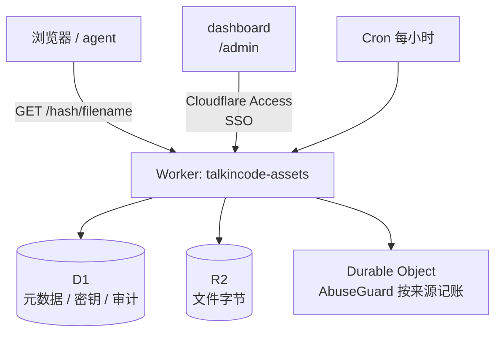

# talkincode-assets

基于 Cloudflare 的私有资产服务：上传图片 / 音频 / 视频 / 任意文件，拿到可过期的分享外链；
资产本身不过期、hash 不可变，可按渠道建多条链接；dashboard 支持预览、标签、Markdown 在线编辑。

- **资产**：不可变 `asset_hash`，字节一直保留，仅人工删除。
- **分享链接**：独立 link hash；`https://assets.talkincode.net/<link_hash>/<filename>`。
  复制/建链时选过期时间；各渠道互不影响。
- **过期**：只挂在链接上（上传默认首链 7 天）；到期 410，**不删** R2。
- **dashboard**：`/admin/`，Cloudflare Access；可预览/建链/吊销/Markdown 编辑。
- **CLI / Agent**：`assets temp <hash|query> --expire 1h -q` 开临时链（**硬上限 4h**）。
- **上传密钥**与暴力破解防护：同前。

## 架构



| 组件 | 作用 |
| --- | --- |
| Worker `talkincode-assets` | 全部路由：公开下载、上传 API、dashboard API、定时清理 |
| D1 `talkincode-assets` | `assets` / `links` / `api_keys` / `audit_log` / `blocked_sources` / `settings` |
| R2 `talkincode-assets` | 对象存储，key 为 `objects/<随机串>`，与公开 link hash 解耦 |
| Durable Object `AbuseGuard` | 每个来源网络（IPv4 /24、IPv6 /64）一份猜错计数与封禁状态 |
| Cloudflare Access | `/admin` 的 SSO 鉴权；Worker 会再次校验 JWT 签名与 `aud`（fail-closed） |

## 路由一览

| 方法 | 路径 | 鉴权 | 说明 |
| --- | --- | --- | --- |
| GET/HEAD | `/<hash>/<filename?>` | 无（link hash 即凭证） | 下载/预览；410=链接过期 |
| POST/PUT | `/api/upload` | 上传密钥 | 建资产 + 首链，返回 link `hash`/`url` + `asset_hash` |
| GET | `/health` | 无 | 存活探测 |
| ANY | `/admin/api/*` | Cloudflare Access | dashboard 与管理 API |
| GET | `/admin/` | Cloudflare Access | dashboard 静态页面 |

## 快速开始

```bash
npm install
npm run types                 # 由 wrangler.toml 生成 Env 类型
npm test                      # workerd 内跑真实 D1/R2/DO 的集成测试

# 1) 建资源（首次）
npx wrangler r2 bucket create talkincode-assets
npx wrangler d1 create talkincode-assets         # 把 database_id 填进 wrangler.toml
npm run db:init                                  # 应用 schema.sql

# 2) 部署
npx wrangler deploy

# 3) 先造一把上传密钥（Access 还没配好时也能用）
node scripts/bootstrap-key.mjs --name laptop

# 4) 配好 dashboard 的 SSO（建应用 + 邮箱白名单 + CLI 用的 service token）
CLOUDFLARE_API_TOKEN=... ./scripts/setup-access.sh --service-token cli
npx wrangler deploy
```

完整步骤（含 Access 控制台手工配置、自定义域名、CI）见 [docs/DEPLOY.md](docs/DEPLOY.md)。

## 用法

### CLI

```bash
export ASSETS_KEY=ak_...            # 上传密钥
./cli/assets.mjs put ./demo.mp4 --expire 7d
# url: https://assets.talkincode.net/9fK.../demo.mp4

export CF_ACCESS_CLIENT_ID=...      # Access service token（管理命令用）
export CF_ACCESS_CLIENT_SECRET=...
./cli/assets.mjs ls --status live --json
./cli/assets.mjs rotate 9fK... --hash NewHashValue123456
./cli/assets.mjs expire 9fK... 30d
./cli/assets.mjs rm 9fK...
```

全部命令见 [docs/CLI.md](docs/CLI.md)，接口细节见 [docs/API.md](docs/API.md)。

### 上传密钥

在 dashboard 的「上传密钥」页创建，或 `node scripts/bootstrap-key.mjs --name ci`。
服务端只存 SHA-256；吊销后立即失效。

### 本地开发

```bash
npm run db:init:local
npm run dev        # http://localhost:8787
npm test           # vitest + workerd（真实绑定，不是 mock）
```

## 设计取舍

- **hash 就是唯一凭证**：22 位 base58（约 128 bit 熵），无法穷举，删除/换 hash 即撤销。
  自定义 hash 最短 16 位，且不能是 `admin`、`api` 等保留路径。
- **删除是软删除**：字节保留 7 天（`trash_retention_days`）可恢复；过期则立即释放。
- **缓存与删除的传播**：内容按 URL 不可变，边缘缓存 `max-age=min(剩余有效期, CACHE_TTL_SECONDS)`，
  默认 60 秒。也就是说删除/过期最多滞后 60 秒全网生效；配置 `CF_PURGE_TOKEN` 后
  删除会走 Cloudflare 精确 URL 清除，立即生效。
- **只有失败请求才记账**：正常下载不触发任何封禁逻辑，热门资源路径上没有额外开销。

## 安全模型

见 [docs/SECURITY.md](docs/SECURITY.md)：hash 熵、密钥存储与轮换、Access 二次校验、
两层暴力破解阻断、响应头与文件名注入防护、已知限制。

## 目录

```
src/            Worker 源码（路由 / 上传 / 公开下载 / 管理 API / 反滥用 / 定时清理）
public/admin/   dashboard（原生 HTML+CSS+JS，无构建步骤）
cli/            agent 友好的 CLI
scripts/        部署与 Access 配置脚本
test/           workerd 内的集成测试
docs/           DEPLOY / API / CLI / SECURITY
```

## License

MIT
